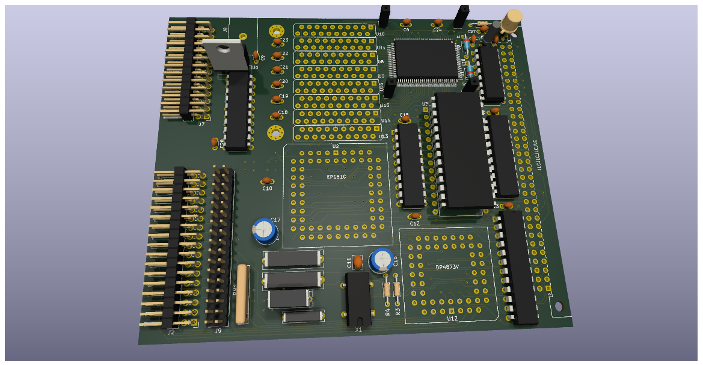
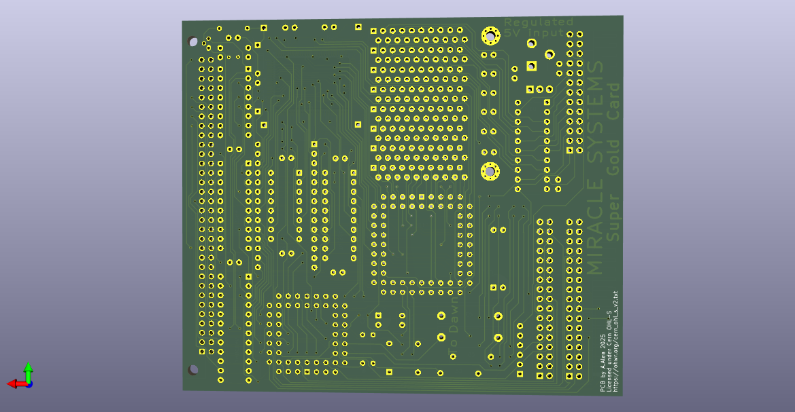

# Miracle Super Gold Card
A reverse engineering exercice using the Sinclair QL Super Gold Card Expansion Card as target

Licensed under Cern OHL-S - https://ohwr.org/cern_ohl_s_v2.txt

(The 3D Model of the PLCC chips is work of Zerover)

## WARNING: DO NOT USE THIS PROJECT IS NOT TESTED AND MISSING THINGS
This is not a functional item, it's only a exercice of reverse engineering to reinforce my skills in Kicad EDA Software.

This project match pictures of the real interface.

* There is no know source of the JEDEC file for the Altera's CPLD
* Some IC can be deprecated and not found on market.
* No information about original PCB, 2 or 4 copper layer, I just use 4, as I was not able to do it in only 2.

Anyway:
* There is not error or warning on the PCB and Schematics
* Schematics seen to be good
* Copper side match 1:1 pictures of internet.
* Component side match pictures of the tetroid clone

For that:
* If you take the risk and do one and it work, please let me know.
* If you have the source of JEDEC file for the CPLD, please let me know.
* If you found any error in the schematic or PLC, please, let me know.

One folder
* Original - The design as similar as posible to the Miracles design.

## The GoldCard Board
This card is a upgrade of the Sinclair QL computer from 1985, it provide a 68020 processor running at 24Mhz and with a bus of 32bit wide, against original 68008, 7,5Mhz and 8bits bus wide, this is theorically 10 times faster than original QL.

Provide Aditional XXXXMb of Ram (32bits) of 4096Mb installed. (128Kb are used as shadow Rom)

Include a up to 4 disk drive (2 conector) compatible with 720Kb, 1.44Mb and 2.88Mb (up to 3.2Mb depend of the format)

Include a centronics port for printer

It have a Real Time Clock.

CPLD have a sticker over it, "INGOT 21".

## Comparative

